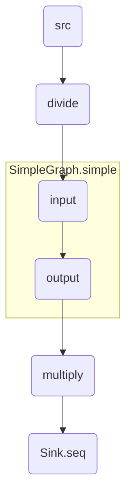
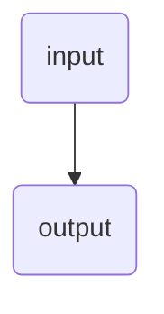

Scalafixmyrules

```mermaid
flowchart TD

Scalafixmyrules_src(src)-->Scalafixmyrules_divide(divide)
Scalafixmyrules_divide-->SimpleGraph_input(input)
subgraph SimpleGraph.simple
SimpleGraph_input-->SimpleGraph_output(output)
end
SimpleGraph_output-->Scalafixmyrules_multiply(multiply)
Scalafixmyrules_multiply-->Scalafixmyrules_Sink_seq(Sink.seq)
```
SimpleGraph.simple

```mermaid
flowchart TD

SimpleGraph_input(input)-->SimpleGraph_output(output)
```
